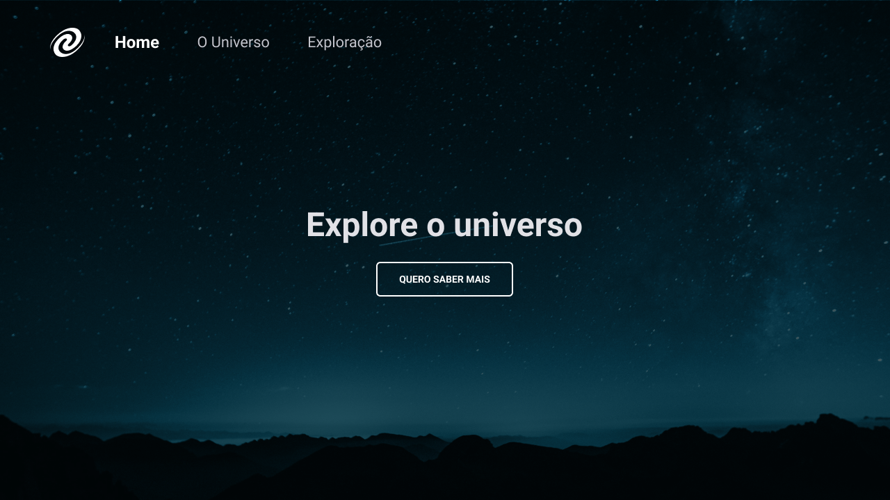
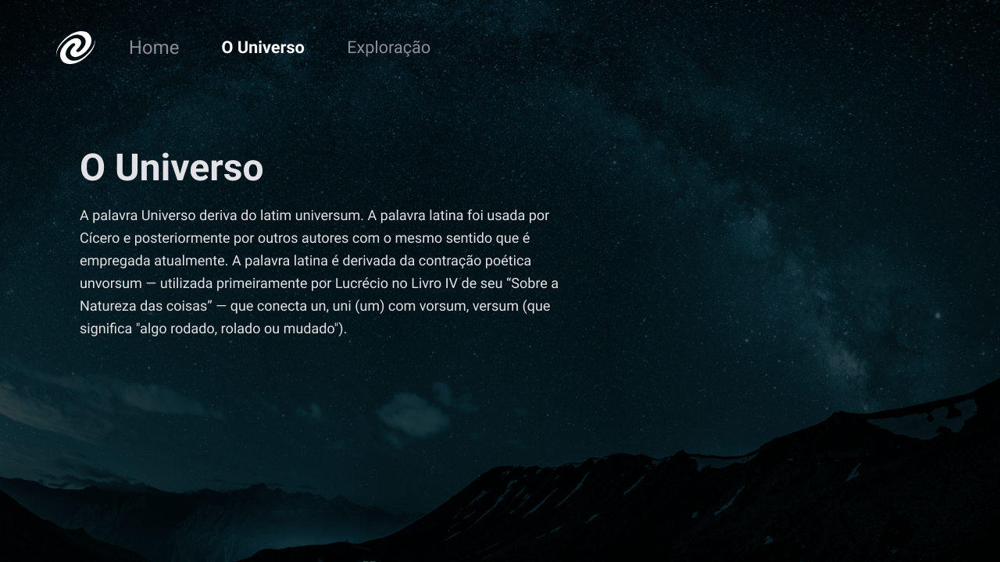

## 💻 Sobre o desafio

Neste desafio proposto no stage 06 do programa Explorer da Rocketseat foi desenvolvido uma Single Page Aplication (SPA) com apenas HTML, CSS e Javascript

## 💡 O que será abordado nesse desafio

- Conceitos de SPA;
- Mapeamento de rotas;
- Assíncrono e promises;
- Orientação a objetos;
- Classes;

## :wrench: Tecnologias

- HTML
- CSS
- JavaScript

---

Feito com 💜 por Victor Nascimento